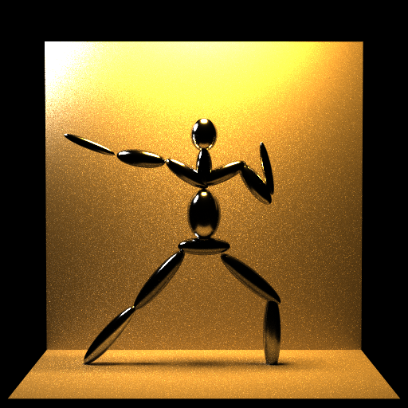
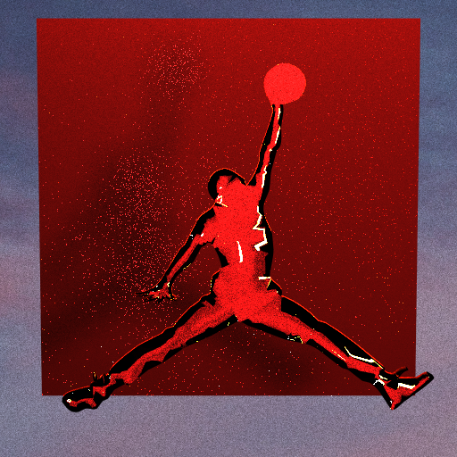
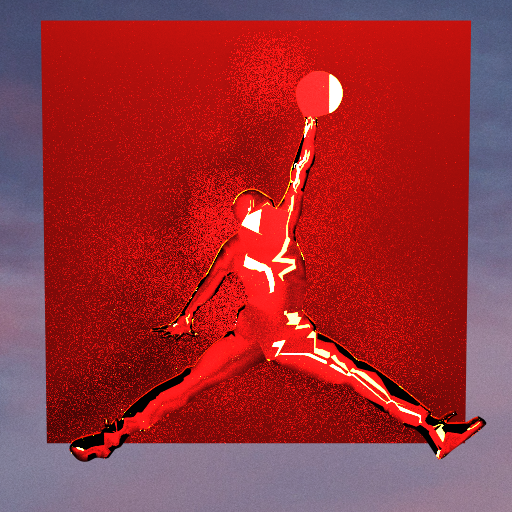
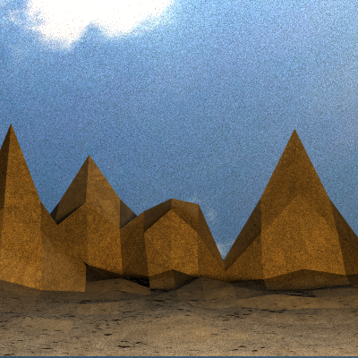
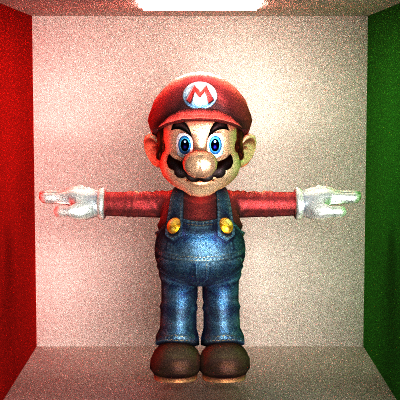
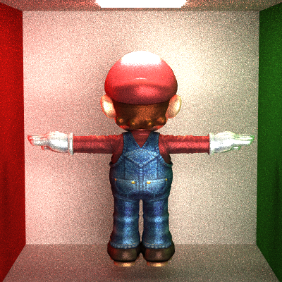
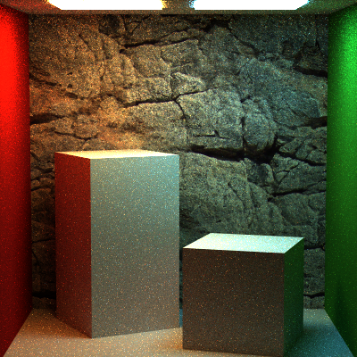
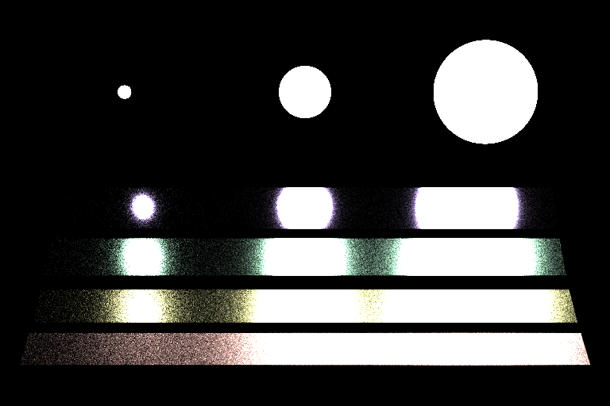
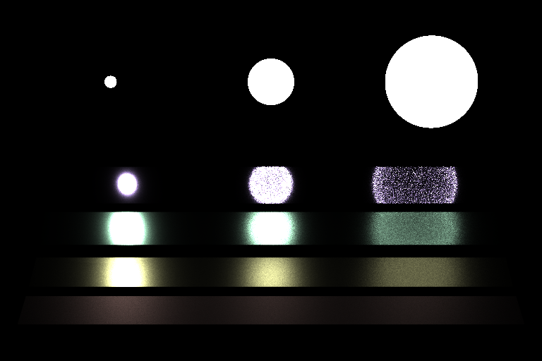

Path Tracer
======================

University of Pennsylvania, CIS 561: Advanced Computer Graphics, course project
------------

Ohter Feature
------------

- Normal Map

- Environment Map 

- Different materials (ChromMirror, glass, plastic, etc.)

Rendered Images
------------

Scene 1 victory pose (Mirror Material)

 

Scene 2 AirJordan Jumpman (Glass Material + Environment Map)

(This one actually a little bit light / uv problem, but I think it's a cool mistake)

Scene 3 mountains (Texture + Normal Map + Environment Map)

Wahoo series

  

Evil Wahoo..(OK, it's just a light problem, too dark)

Normal Map Comparision (left back wall with normal map, right without)

  

TwoLights Cornell Box

Veach scene with Naive and direct lighting integrator

    

Glass Ball scene

 64_eta 1.5.png

