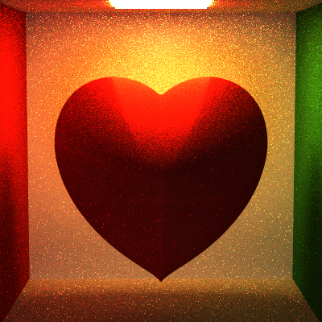

Path Tracer
======================

University of Pennsylvania, CIS 561: Advanced Computer Graphics, Course project
------------

Features :
------------

- Normal Map

- Diffuse are light, point light, spot light, infinite light(Environment Map)

- Different materials (Metal, ChromMirror, glass, plastic, etc.)

- Acceleration : BVH / Kd-Tree

- Lens-based Camera

- Implicit Surface Rendering

- Photon Mapper (may take super longer time, but render merges quite well!)

- Volume Rendering

Rendered Images
------------

Volume Rendering :

Original Photon Mapper render

thin & thick white fog volume render 

    

final volume render we get

    

Photon Mapper : Rainbow Box

Implicit Surface Rendering using Ray-marching

Lens-based Camera with Lens Radius = 1.0 , 5.0, 10.0

  

Complex model rendered within just few minutes (general <10min depends on your computer)with BVH/Kd-Tree and more the 1 hour at least without it.

900 ssp MIS Glass dragon (around 3min rendering time) / 900 ssp MIS Happy Buddha (around 4min rendering time)

   

victory pose (Mirror Material)

 

Glass cup and ball (Environment Map)

 

AirJordan Jumpman (Glass Material + Environment Map)

(This one actually a little bit light / uv problem, but I think it's a cool mistake)

Mountains (Texture + Normal Map + Environment Map)

Wahoo series

  

Wahoo's War(several different color point lights)

Evil Wahoo..(OK, it's just a light problem, too dark)

Normal Map Comparision (left back wall with normal map, right without)

  

TwoLights Cornell Box

Veach scene with Naive and direct lighting integrator

    

Glass Ball scene

